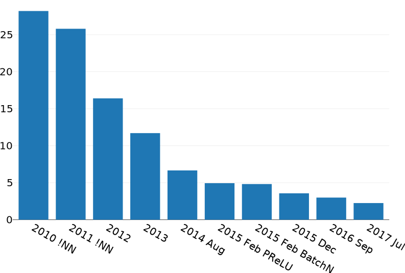
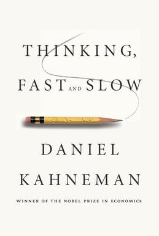
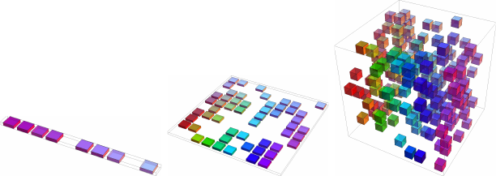
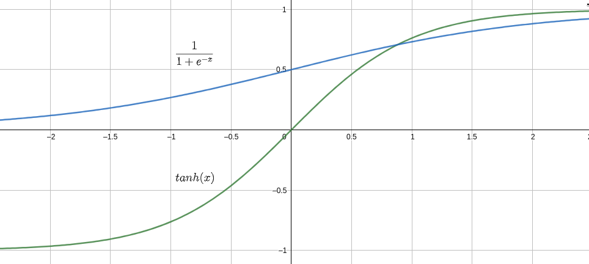
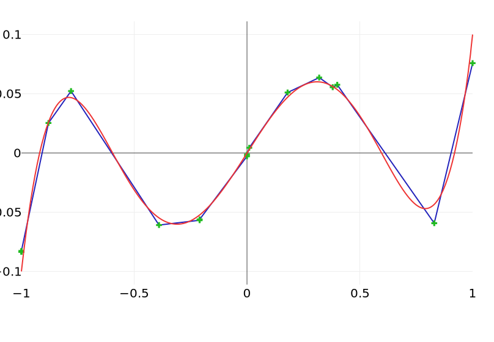
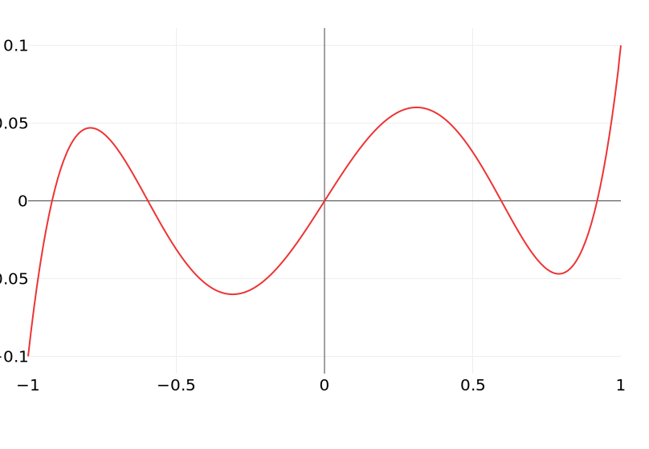
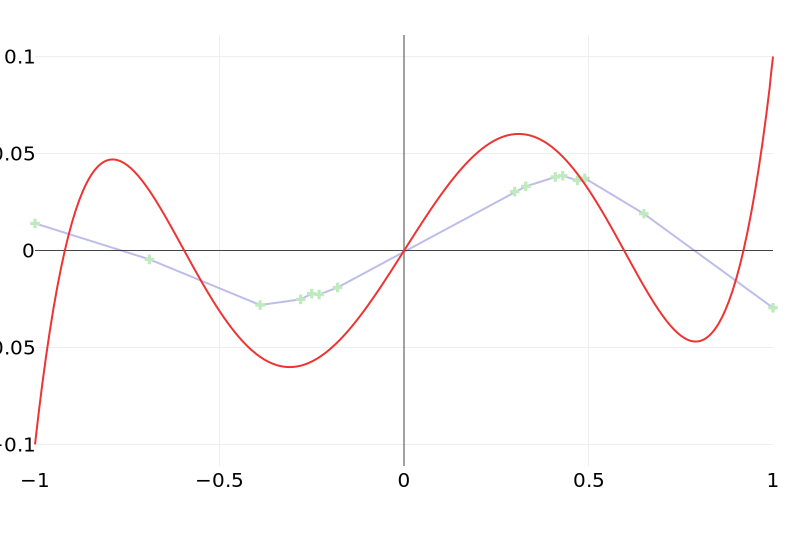
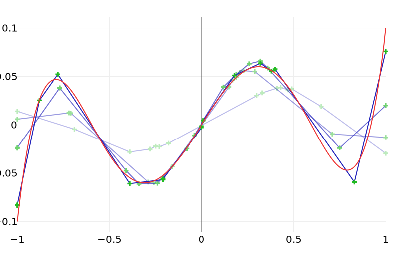
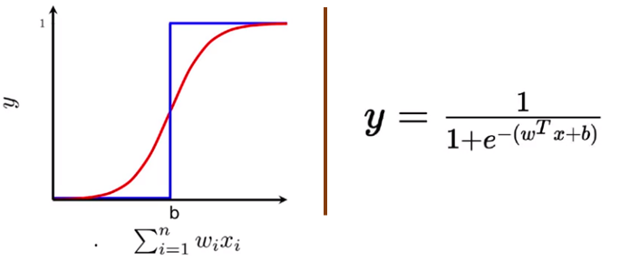

title: NPFL114, Lecture 1
class: title, langtech, cc-by-nc-sa
# Introduction to Deep Learning

## Milan Straka

### February 14, 2022

---
# What is Deep Learning

---
# Deep Learning Highlights
- Image recognition

~~~ ~
# Deep Learning Highlights

~~~ ~~
- Object detection
~~~ ~
# Deep Learning Highlights

~~~ ~~
- Image segmentation
~~~ ~
# Deep Learning Highlights

~~~ ~~
- Human pose estimation
~~~ ~
# Deep Learning Highlights

~~~ ~~
- Image labeling
~~~ ~
# Deep Learning Highlights

~~~ ~~
- Visual question answering
~~~ ~
# Deep Learning Highlights

~~~ ~~
- Speech recognition and generation
~~~ ~
# Deep Learning Highlights

<audio controls style="width: 32%"><source src="https://google.github.io/tacotron/publications/tacotron2/demos/washington_gen.wav"></audio>
<audio controls style="width: 32%"><source src="https://google.github.io/tacotron/publications/tacotron2/demos/fox_question.wav"></audio>
<audio controls style="width: 32%"><source src="https://google.github.io/tacotron/publications/tacotron2/demos/gan_or_vae.wav"></audio>

~~~ ~~
- Lip reading
~~~ ~
# Deep Learning Highlights

~~~ ~~
- Machine translation
~~~ ~
# Deep Learning Highlights

~~~ ~~
- Machine translation without parallel data
~~~ ~
# Deep Learning Highlights

~~~ ~~
- Chess, Go and Shogi
~~~ ~
# Deep Learning Highlights

~~~ ~~
- Multiplayer Capture the flag
~~~ ~
# Deep Learning Highlights

~~~ ~~
- StarCraft II
~~~ ~
# Deep Learning Highlights

~~~ ~~

---
section: Organization

# Organization

**Course Website:** https://ufal.mff.cuni.cz/courses/npfl114
~~~
  - Slides, recordings, assignments, Exam questions
~~~

**Course Repository:** https://github.com/ufal/npfl114
- Templates for the assignments, slide sources.

~~~
## Piazza

- Piazza will be used as a communication platform.

  You can post questions or notes,
  - privately to the instructors, or
~~~
  - to everyone (signed or anonymously).
~~~

  Students can answer other student's questions too, which allows you to get
  faster response. Please do not send complete solutions to other students,
  only excerpts of the source files.

~~~
- Please use Piazza for **all communication** with the instructors.
~~~
- You will get the invite link after the first lecture.

---
# ReCodEx

https://recodex.mff.cuni.cz

- The assignments will be evaluated automatically in ReCodEx.
~~~
- If you have a MFF SIS account, you will be able to create an account
  using your CAS credentials and should automatically see the right group.
~~~
- Otherwise, there will be **instructions** on **Piazza** how to get
  ReCodEx account (generally you will need to send me a message with several
  pieces of information and I will send it to ReCodEx administrators in
  batches).

---
# Course Requirements

## Practicals
~~~

- There will be 2-3 assignments a week, each with a 2-week deadline.
~~~
  - There is also another week-long second deadline, but for less points.
~~~
- After solving the assignment, you get non-bonus points, and sometimes also
  bonus points.
~~~
- To pass the practicals, you need to get 80 non-bonus points. There will be
  assignments for at least 120 non-bonus points.
~~~
- If you get more than 80 points (be it bonus or non-bonus), they will be
  all transferred to the exam. Additionally, if you solve all the assignments,
  you pass the exam with grade 1.

~~~
## Lecture

You need to pass a written exam (or solve all the assignments).
~~~
- All questions are publicly listed on the course website.
~~~
- There are questions for 100 points in every exam, plus the surplus
  points from the practicals and plus at most 10 surplus points for **community
  work** (improving slides, …).
~~~
- You need 60/75/90 points to pass with grade 3/2/1; 75 points for PhD students.

---
section: Notation
# Notation

- $a$, $→a$, $⇉A$, $⇶A$: scalar (integer or real), vector, matrix, tensor

~~~
  - all vectors are always **column** vectors
~~~
  - transposition changes a column vector into a row vector, so $→a^T$ is a row vector
~~~
  - we denote **scalar product** between vectors $→a$ and $→b$ as $→a^T →b$
    - we understand it as matrix multiplication
~~~
  - the $\|→a\|_2$ or just $\|→a\|$ is the Euclidean (or $L^2$) norm
    - $\|→a\|_2 = \sqrt{\sum_i a_i^2}$
~~~

- $⁇a$, $⁇→a$, $⁇⇉A$: scalar, vector, matrix random variable

~~~
- $\frac{df}{dx}$: derivative of $f$ with respect to $x$

- $\frac{∂f}{∂x}$: partial derivative of $f$ with respect to $x$

~~~
- $∇_{→x} f(→x)$: gradient of $f$ with respect to $→x$, i.e.,
  $\left(\frac{∂f(→x)}{∂x_1}, \frac{∂f(→x)}{∂x_2}, \ldots, \frac{∂f(→x)}{∂x_n}\right)$

---
section: Random Variables
# Random Variables
A random variable $⁇x$ is a result of a random process. It can be discrete or
continuous.

~~~
## Probability Distribution
A probability distribution describes how likely are individual values a random
variable can take.

The notation $⁇x ∼ P$ stands for a random variable $⁇x$ having a distribution $P$.

~~~
For discrete variables, the probability that $⁇x$ takes a value $x$ is denoted as
$P(x)$ or explicitly as $P(⁇x = x)$. All probabilities are non-negative and sum
of probabilities of all possible values of $⁇x$ is $∑_x P(⁇x=x) = 1$.

~~~
For continuous variables, the probability that the value of $⁇x$ lies in the interval
$[a, b]$ is given by $∫_a^b p(x)\d x$, where $p(x)$ is the _probability density
function_, which is always non-negative and integrates to 1 over the range of
all values of $⁇x$.

---
style: .katex-display { margin: 0.8em 0 }
# Joint, Conditional, Marginal Probability

For two random variables, **joint probability distribution** is a distribution
of all possible pairs of outputs (and analogously for more than two):

$$P(⁇x = x_2, ⁇y = y_1).$$

~~~
**Marginal distribution** is a distribution of one (or a subset) of the random
variables and can be obtained by summing over the other variable(s):
$$P(⁇x=x_2) = {\small ∑\nolimits}_y P(⁇x = x_2, ⁇y = y).$$

~~~
**Conditional distribution** is a distribution of one (or a subset) of the
random variables, given that another event has already occurred:
$$P(⁇x=x_2 | ⁇y=y_1) = P(⁇x = x_2, ⁇y = y_1) / P(⁇y = y_1).$$

~~~
If $P(⁇x, ⁇y) = P(⁇x) ⋅ P(⁇y)$ or $P(⁇x | ⁇y) = P(⁇x)$, random variables $⁇x$ and $⁇y$ are **independent**.

---
# Random Variables

## Expectation
The expectation of a function $f(x)$ with respect to discrete probability
distribution $P(x)$ is defined as:
$$𝔼_{⁇x ∼ P}[f(x)] ≝ ∑_x P(x)f(x).$$

For continuous variables it is computed as:
$$𝔼_{⁇x ∼ p}[f(x)] ≝ ∫_x p(x)f(x)\d x.$$

~~~
If the random variable is obvious from context, we can write only $𝔼_P[x]$
or even $𝔼[x]$.

~~~
Expectation is linear, i.e.,
$$𝔼_⁇x [αf(x) + βg(x)] = α𝔼_⁇x [f(x)] + β𝔼_⁇x [g(x)].$$

---
# Random Variables

## Variance
Variance measures how much the values of a random variable differ from its
mean $μ = 𝔼[x]$.

$$\begin{aligned}
  \Var(x) &≝ 𝔼\left[\big(x - 𝔼[x]\big)^2\right]\textrm{, or more generally,} \\
  \Var(f(x)) &≝ 𝔼\left[\big(f(x) - 𝔼[f(x)]\big)^2\right].
\end{aligned}$$

~~~
It is easy to see that
$$\Var(x) = 𝔼\left[x^2 - 2x𝔼[x] + \big(𝔼[x]\big)^2\right] = 𝔼\left[x^2\right] - \big(𝔼[x]\big)^2,$$
because $𝔼\big[2x𝔼[x]\big] = 2(𝔼[x])^2$.

~~~
Variance is connected to $𝔼[x^2]$, the **second moment** of a random
variable – it is in fact a **centered** second moment.

---
# Common Probability Distributions
## Bernoulli Distribution
The Bernoulli distribution is a distribution over a binary random variable.
It has a single parameter $φ ∈ [0, 1]$, which specifies the probability of the random
variable being equal to 1.

~~~
$$\begin{aligned}
  P(x) &= φ^x (1-φ)^{1-x} \\
  𝔼[x] &= φ \\
  \Var(x) &= φ(1-φ)
\end{aligned}$$

---
# Common Probability Distributions
## Categorical Distribution
Extension of the Bernoulli distribution to random variables taking one of $K$ different
discrete outcomes. It is parametrized by $→p ∈ [0, 1]^K$ such that $∑_{i=0}^{K-1} p_{i} = 1$.

~~~
We represent outcomes as vectors $∈ \{0, 1\}^K$ in the **one-hot encoding**.
Therefore, an outcome $x ∈ \{0, 1, …, K-1\}$ is represented as a vector
$$→1_x ≝ \big([i = x]\big)_{i=0}^{K-1} = \big(\underbrace{0, …, 0}_{k}, 1, \underbrace{0, …, 0}_{K-k-1}\big).$$

~~~
The outcome probability, mean and variance are very similar to the Bernoulli
distribution.
$$\begin{aligned}
  P(→x) &= ∏\nolimits_{i=0}^{K-1} p_i^{x_i} \\
  𝔼[x_i] &= p_i \\
  \Var(x_i) &= p_i(1-p_i) \\
\end{aligned}$$

---
section: Information Theory
# Information Theory

## Self Information

Amount of **surprise** when a random variable is sampled.
~~~
- Should be zero for events with probability 1.
~~~
- Less likely events are more surprising.
~~~
- Independent events should have **additive** information.

~~~
$$I(x) ≝ -\log P(x) = \log \frac{1}{P(x)}$$

---
# Information Theory

## Entropy

Amount of **surprise** in the whole distribution.
$$H(P) ≝ 𝔼_{⁇x∼P}[I(x)] = -𝔼_{⁇x∼P}[\log P(x)]$$

~~~
- for discrete $P$: $H(P) = -∑_x P(x) \log P(x)$
- for continuous $P$: $H(P) = -∫ P(x) \log P(x)\,\mathrm dx$

~~~
Because $\lim_{x → 0} x \log x = 0$, for $P(x) = 0$ we consider\
$P(x) \log P(x)$ to be zero.

~~~ ~~~

- for discrete $P$: $H(P) = -∑_x P(x) \log P(x)$
- for continuous $P$: $H(P) = -∫ P(x) \log P(x)\,\mathrm dx$

Because $\lim_{x → 0} x \log x = 0$, for $P(x) = 0$ we consider
$P(x) \log P(x)$ to be zero.

~~~
Note that in the continuous case, the continuous entropy (also called
_differential entropy_) has slightly different semantics, for example, it can be
negative.

~~~
From now on, all logarithms are _natural logarithms_ with base $e$.

---
# Information Theory

## Cross-Entropy

$$H(P, Q) ≝ -𝔼_{⁇x∼P}[\log Q(x)]$$

~~~
**Gibbs inequality** states that
- $H(P, Q) ≥ H(P)$
- $H(P) = H(P, Q) ⇔ P = Q$
~~~
- Proof: Using the fact that $\log x ≤ (x-1)$ with equality only for $x=1$, we get
  $$∑_x P(x) \log \frac{Q(x)}{P(x)} ≤ ∑_x P(x) \left(\frac{Q(x)}{P(x)}-1\right) = ∑_x Q(x) - ∑_x P(x) = 0.$$
~~~
- Corollary: For a categorical distribution with $n$ outcomes, $H(P) ≤ \log n$,
  because for $Q(x) = 1/n$ we get $H(P) ≤ H(P, Q) = -∑_x P(x) \log Q(x) = \log n.$
~~~

Note that generally $H(P, Q) ≠ H(Q, P)$.

---
# Information Theory

## Kullback-Leibler Divergence (KL Divergence)

Sometimes also called **relative entropy**.

$$D_\textrm{KL}(P \| Q) ≝ H(P, Q) - H(P) = 𝔼_{⁇x∼P}[\log P(x) - \log Q(x)]$$

~~~
- consequence of Gibbs inequality: $D_\textrm{KL}(P \| Q) ≥ 0$, $D_\textrm{KL}(P \| Q) = 0$ iff $P = Q$
~~~
- generally $D_\textrm{KL}(P \| Q) ≠ D_\textrm{KL}(Q \| P)$

---
# Nonsymmetry of KL Divergence

---
# Common Probability Distributions
## Normal (or Gaussian) Distribution
Distribution over real numbers, parametrized by a mean $μ$ and variance $σ^2$:
$$𝓝(x; μ, σ^2) = \sqrt{\frac{1}{2πσ^2}} \exp \left(-\frac{(x - μ)^2}{2σ^2}\right)$$

~~~
For standard values $μ=0$ and $σ^2=1$ we get $𝓝(x; 0, 1) = \sqrt{\frac{1}{2π}} e^{-\frac{x^2}{2}}$.

---
# Why Normal Distribution

## Central Limit Theorem
The sum of independent identically distributed random variables
with finite variance converges to normal distribution.

~~~
## Principle of Maximum Entropy
Given a set of constraints, a distribution with maximal entropy fulfilling the
constraints can be considered the most general one, containing as little
additional assumptions as possible.

~~~
Considering distributions on all real numbers with a given mean and variance, it
can be proven (using variational inference) that such a distribution with
**maximum entropy** is exactly the normal distribution.

---
section: Machine Learning
# Machine Learning

A possible definition of learning from Mitchell (1997):
>  A computer program is said to learn from experience E with respect to some
>  class of tasks T and performance measure P, if its performance at tasks in
>  T, as measured by P, improves with experience E.

~~~
- Task T
    - _classification_: assigning one of $k$ categories to a given input
    - _regression_: producing a number $x∈ℝ$ for a given input
    - _structured prediction_, _denoising_, _density estimation_, …
~~~
- Measure P
    - _accuracy_, _error rate_, _F-score_, …
~~~
- Experience E
    - _supervised_: usually a dataset with desired outcomes (_labels_ or
      _targets_)
    - _unsupervised_: usually data without any annotation (raw text, raw images, …)
    - _reinforcement learning_, _semi-supervised learning_, …

---
# Well-known Datasets

| Name | Description | Instances |
| ------ | ------------- | ----------- |
| [MNIST](http://yann.lecun.com/exdb/mnist/) | Images (28x28, grayscale) of handwritten digits. | 60k |
| [CIFAR-10](https://www.cs.toronto.edu/~kriz/cifar.html) | Images (32x32, color) of 10 classes of objects. | 50k |
| [CIFAR-100](https://www.cs.toronto.edu/~kriz/cifar.html) | Images (32x32, color) of 100 classes of objects (with 20 defined superclasses). | 50k |
| [ImageNet](http://image-net.org/) | Labeled object image database (labeled objects, some with bounding boxes). | 14.2M |
| [ImageNet-ILSVRC](http://image-net.org/challenges/LSVRC/) | Subset of ImageNet for Large Scale Visual Recognition Challenge, annotated with 1000 object classes and their bounding boxes. | 1.2M |
| [COCO](http://cocodataset.org/) | _Common Objects in Context_: Complex everyday scenes with descriptions (5) and highlighting of objects (91 types). | 2.5M |

---
class: middle
# Well-known Datasets
## ImageNet-ILSVRC

---
class: middle
# Well-known Datasets
## COCO

---
# Well-known Datasets

| Name | Description | Instances |
| ------ | ------------- | ----------- |
| [IAM-OnDB](http://www.fki.inf.unibe.ch/databases/iam-on-line-handwriting-database) | Pen tip movements of handwritten English from 221 writers. | 86k words |
| [TIMIT](https://catalog.ldc.upenn.edu/LDC93S1) | Recordings of 630 speakers of 8 dialects of American English. | 6.3k sents |
| [CommonVoice](https://voice.mozilla.org/data) | 400k recordings from 20k people, around 500 hours of speech. | 400k
| [PTB](https://catalog.ldc.upenn.edu/LDC99T42) | _Penn Treebank_: 2500 stories from Wall Street Journal, with POS tags and parsed into trees. | 1M words |
| [PDT](https://ufal.mff.cuni.cz/prague-dependency-treebank) | _Prague Dependency Treebank_: Czech sentences annotated on 4 layers (word, morphological, analytical, tectogrammatical). | 1.9M words |
| [UD](http://universaldependencies.org/) | _Universal Dependencies_: Treebanks of 104 languages with consistent annotation of lemmas, POS tags, morphology, syntax. | 183 treebanks |
| [WMT](http://statmt.org/) | Aligned parallel sentences for machine translation. | gigawords |

---
# ILSVRC Image Recognition Error Rates

~~~ ~
# ILSVRC Image Recognition Error Rates

---
# ILSVRC Image Recognition Error Rates

In summer 2017, a paper came out describing automatic generation of
neural architectures using reinforcement learning.

---
# ILSVRC Image Recognition Error Rates

Currently, one of the best architectures is EfficientNet, which combines
automatic architecture discovery, multidimensional scaling and elaborate dataset
augmentation methods.

---
# ILSVRC Image Recognition Error Rates

EfficientNet was further improved by EfficientNetV2 two years later.

---
# Machine Translation Improvements

To illustrate deep neural networks improvements in other domains, consider the
English→Czech results of the international Workshop on Machine Translation.
Both the automatic BLEU metric and manual evaluation are presented.

- TectoMT parses the input, transfers to the other language, generates the sentence;
- RBMT is the PC-Translator software;
- SMT is statistical machine translation using the Moses system;
- Online is an online translation system (Google in 2009, `Online-B` since 2010);
- **NMT** is the neural machine translation using deep neural networks.

---
class: wide
# Introduction to Deep Learning History

---
# How Good is Current Deep Learning

- DL has seen amazing progress in the last ten years.

~~~
- Is it enough to get a bigger brain (datasets, models, computer power)?

~~~

~~~
- Problems compared to Human learning:
  - Sample efficiency
~~~
  - Human-provided labels
~~~
  - Robustness to data distribution change
~~~
  - Stupid errors

---
# How Good is Current Deep Learning

~~~

---
# How Good is Current Deep Learning

- Thinking fast and slow

~~~
  - System 1

    - intuitive
    - fast
    - automatic
    - frequent
    - unconscious
~~~

    Current DL
~~~
  - System 2

    - logical
    - slow
    - effortful
    - infrequent
    - conscious
~~~

    Future DL

---
# Curse of Dimensionality

---
# Machine and Representation Learning

---
section: NNs '80s
# Neural Network Architecture à la '80s

---
# Neural Network Architecture

There is a weight on each edge, and an activation function $f$ is performed on the
hidden layers, and optionally also on the output layer.
$$h_i = f\left(∑_j w_{i,j} x_j + b_i\right)$$

~~~
If the network is composed of layers, we can use matrix notation and write
$$→h = f\left(⇉W →x + →b\right),$$
where $⇉W ∈ ℝ^{|\mathit{hidden~neurons}|×|\mathit{input~neurons}|}$ is a matrix
of weights and $→b ∈ ℝ^{|\mathit{hidden~neurons}|}$ is a vector of biases.

---
# Neural Network Activation Functions
## Output Layers
- none (linear regression if there are no hidden layers)

~~~
- $σ$ (sigmoid; logistic regression if there are no hidden layers)
  $$σ(x) ≝ \frac{1}{1 + e^{-x}}$$
  is used to model a probability $p$ of a binary event; its input is called
  a **logit**, $\log \frac{p}{1-p}$

~~~
- $\softmax$ (maximum entropy model if there are no hidden layers)
  $$\begin{gathered}
    \softmax(→x) ∝ e^{→x} \\
    \softmax(→x)_i ≝ \frac{e^{x_i}}{∑_j e^{x_j}}
  \end{gathered}$$
  is used to model probability distribution $→p$; its input is called
  a **logit**, $\log(→p) + c$

---
# Neural Network Activation Functions
## Hidden Layers
- none: does not help, composition of linear mapping is a linear mapping

~~~
- $σ$: however, it works badly – nonsymmetrical, repeated application converges to
  the fixed point $x = σ(x) ≈ 0.659$, and $\frac{dσ}{dx}(0) = 1/4$

~~~
- $\tanh$
    - result of making $σ$ symmetrical and making the derivative in zero 1
    - $\tanh(x) = 2σ(2x) - 1$
  

~~~
- ReLU: $\max(0, x)$

---
# Universal Approximation Theorem '89

Let $φ(x):ℝ → ℝ$ be a nonconstant, bounded and nondecreasing continuous function. \
(Later a proof was given also for $φ = \ReLU$ and even for any nonpolynomial
function.)

For any $ε > 0$ and any continuous function $f: [0, 1]^D → ℝ$, there exists
$H ∈ ℕ$, $→v ∈ ℝ^H$, $→b ∈ ℝ^H$ and $⇉W ∈ ℝ^{H×D}$, such that if we denote
$$F(→x) = →v^T φ(⇉W→x + →b) = ∑_{i=1}^H v_i φ(→W_i^T →x + b_i),$$
where $φ$ is applied elementwise,
~~~
then for all $→x ∈ [0, 1]^D$:
$$|F(→x) - f(→x)| < ε.$$

---
# Universal Approximation Theorem for ReLUs

Sketch of the proof:

~~~
- If a function is continuous on a closed interval, it can be approximated by
  a sequence of lines to arbitrary precision.

~~~
- However, we can create a sequence of $k$ linear segments as a sum of $k$ ReLU
  units – on every endpoint a new ReLU starts (i.e., the input ReLU value is
  zero at the endpoint), with a tangent which is the difference between the
  target tangent and the tangent of the approximation until this point.

---
# Evolving ReLU Approximation

~~~ ~
# Evolving ReLU Approximation

~~~ ~
# Evolving ReLU Approximation

~~~ ~
# Evolving ReLU Approximation

~~~ ~
# Evolving ReLU Approximation

---
# Universal Approximation Theorem for Squashes

Sketch of the proof for a squashing function $φ(x)$ (i.e., nonconstant, bounded and
nondecreasing continuous function like sigmoid):

~~~
- We can prove $φ$ can be arbitrarily close to a hard threshold by compressing
  it horizontally.

~~~
- Then we approximate the original function using a series of straight line
  segments

