title: NPFL114, Lecture 10
class: title, langtech, cc-by-nc-sa

# Seq2seq, NMT, Transformer

## Milan Straka

### May 03, 2021

---
section: Seq2seq
class: middle, center
# Sequence-to-Sequence Architecture

# Sequence-to-Sequence Architecture

---
# Sequence-to-Sequence Architecture

---
# Sequence-to-Sequence Architecture

---
# Sequence-to-Sequence Architecture

## Training

The so-called _teacher forcing_ is used during training – the gold outputs are
used as inputs during training.

~~~
## Inference

During inference, the network processes its own predictions.

Usually, the generated logits are processed by an $\argmax$, the chosen word
embedded and used as next input.

---
# Tying Word Embeddings

---
section: Attention
# Attention

As another input during decoding, we add _context vector_ $c_i$:
$$→s_i = f(→s_{i-1}, →y_{i-1}, →c_i).$$

~~~
We compute the context vector as a weighted combination of source sentence
encoded outputs:
$$→c_i = ∑_j α_{ij} →h_j$$

~~~
The weights $α_{ij}$ are softmax of $e_{ij}$ over $j$,
$$→α_i = \softmax(→e_i),$$
with $e_{ij}$ being
$$e_{ij} = →v^\top \tanh(⇉V→h_j + ⇉W→s_{i-1} + →b) .$$

---
# Attention

---
section: SubWords
# Subword Units

Translate _subword units_ instead of words. The subword units can be generated
in several ways, the most commonly used are:

~~~
- **BPE**:
  Using the _byte pair encoding_ algorithm. Start with individual characters plus
  a special end-of-word symbol $⋅$. Then, merge the most occurring symbol pair
  $A, B$ by a new symbol $AB$, with the symbol pair never crossing word boundary
  (so that the end-of-word symbol cannot be inside a subword).

~~~
  Considering a dictionary with words _low, lowest, newer, wider_, a possible
  sequence of merges:

  $$\begin{aligned}
    r \,\,\, ⋅ & → r⋅ \\
    l \,\,\, o & → lo \\
    lo \,\,\, w & → low \\
    e \,\,\, r⋅ & → er⋅ \\
  \end{aligned}$$

---
# Subword Units

- **Wordpieces**:
  Given a text divided into subwords, we can compute unigram probability of
  every subword, and then get the likelihood of the text under a unigram language
  model by multiplying the probabilities of the subwords in the text.

~~~
  When we have only a text and a subword dictionary, we divide the text in
  a greedy fashion, iteratively choosing the longest existing subword.

~~~
  When constructing the subwords, we again start with individual characters, and
  then repeatedly join such a pair of subwords, which increases the unigram
  language model likelihood the most.

~~~
Both approaches give very similar results; a biggest difference is that during
the inference:
- for BPE, the sequence of merges must be performed in the same order as during
  the construction of the BPE;
~~~
- for Wordpieces, it is enough to find longest matches from the subword
  dictionary.

~~~
Usually quite little subword units are used (32k-64k), often generated on the
union of the two vocabularies (the so-called _joint BPE_ or _shared
wordpieces_).

---
section: GNMT
# Google NMT

---
# Google NMT

---
# Google NMT

---
# Beyond one Language Pair

---
# Beyond one Language Pair

---
# Multilingual and Unsupervised Translation

Many attempts at multilingual translation.

- Individual encoders and decoders, shared attention.

- Shared encoders and decoders.

~~~
Surprisingly, even unsupervised translation is attempted lately.
By unsupervised we understand settings where we have access to large
monolingual corpora, but no parallel data.

~~~
In 2019, the best unsupervised systems were on par with the best 2014 supervised
systems.

---
section: Transformer
# Attention is All You Need

For some sequence processing tasks, _sequential_ processing (as performed by
recurrent neural networks) of its elements might be too restrictive.

~~~
Instead, we may want to be able to combine sequence elements independently on
their distance.

~~~
Such processing is allowed in the *Transformer* architecture, originally
proposed for neural machine translation in 2017 in *Attention is All You Need*
paper.

---
# Transformer

---
# Transformer

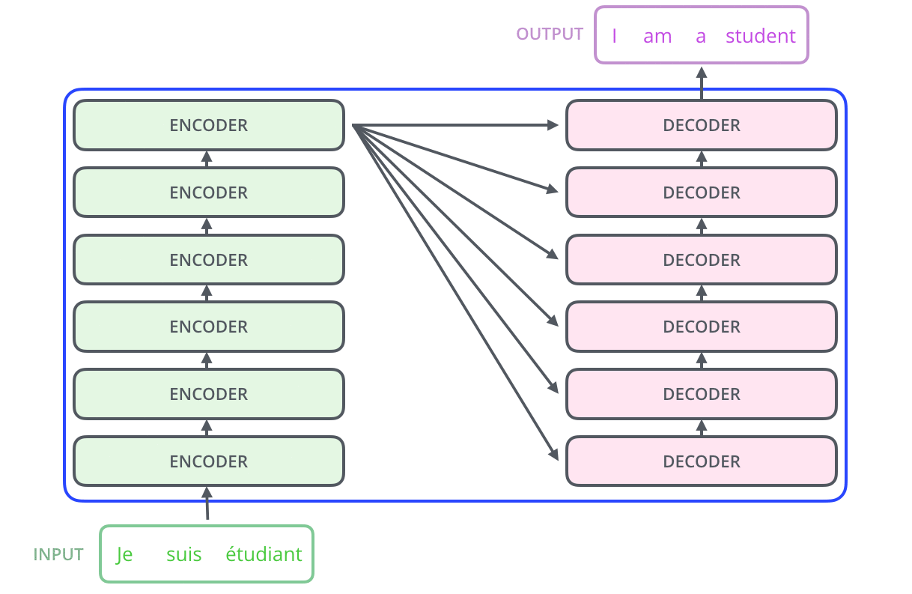

---
# Transformer

---
# Transformer

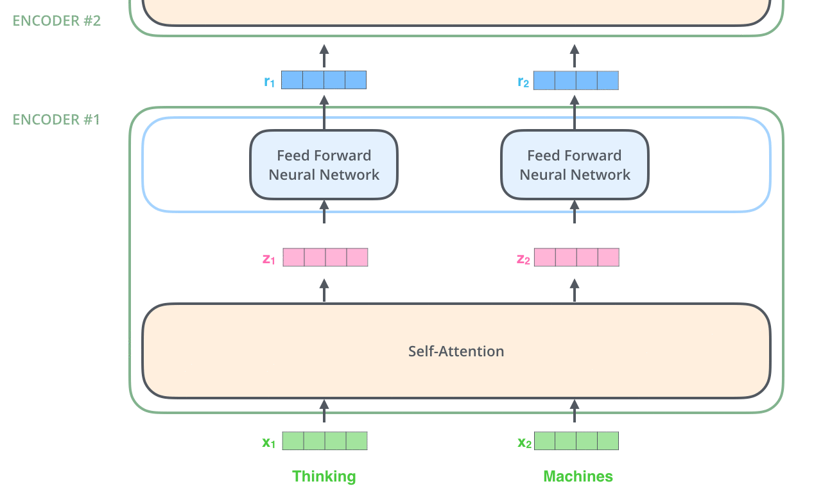

---
section: SelfAttention
# Transformer – Self-Attention

Assume that we have a sequence of $n$ words represented using a matrix $⇉X ∈ ℝ^{n×d}$.

The attention module for a queries $⇉Q ∈ ℝ^{n×d_k}$, keys $⇉K ∈ ℝ^{n×d_k}$ and values $⇉V ∈ ℝ^{n×d_v}$ is defined as:

$$\textrm{Attention}(⇉Q, ⇉K, ⇉V) = \softmax\left(\frac{⇉Q ⇉K^\top}{\sqrt{d_k}}\right)⇉V.$$

The queries, keys and values are computed from the input word representations $⇉X$
using a linear transformation as
$$\begin{aligned}
  ⇉Q &= ⇉W^Q ⋅ ⇉X \\
  ⇉K &= ⇉W^K ⋅ ⇉X \\
  ⇉V &= ⇉W^V ⋅ ⇉X \\
\end{aligned}$$

---
# Transformer – Self-Attention

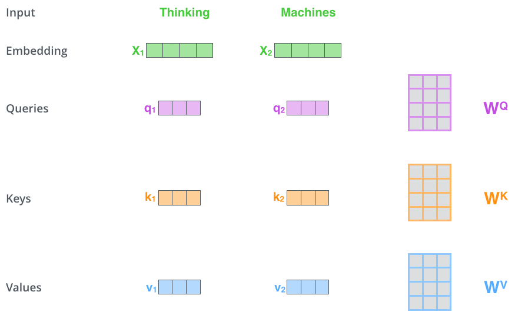

---
# Transformer – Self-Attention

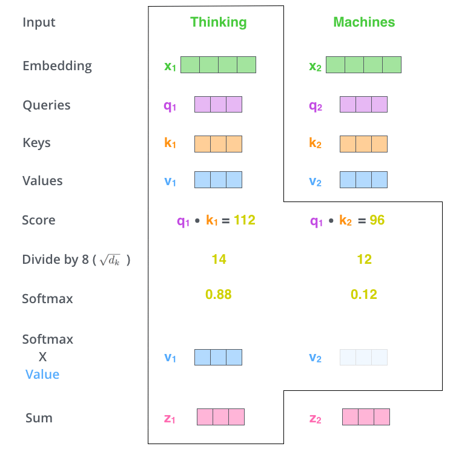

---
# Transformer – Self-Attention

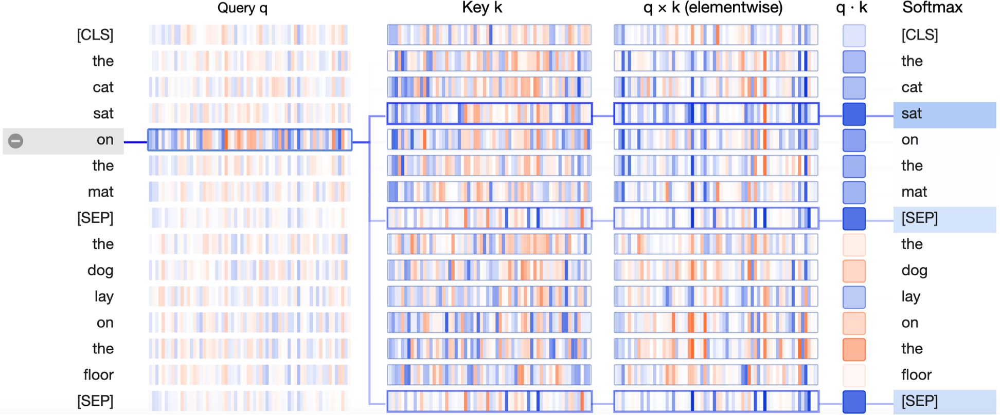

---
# Transformer – Self-Attention

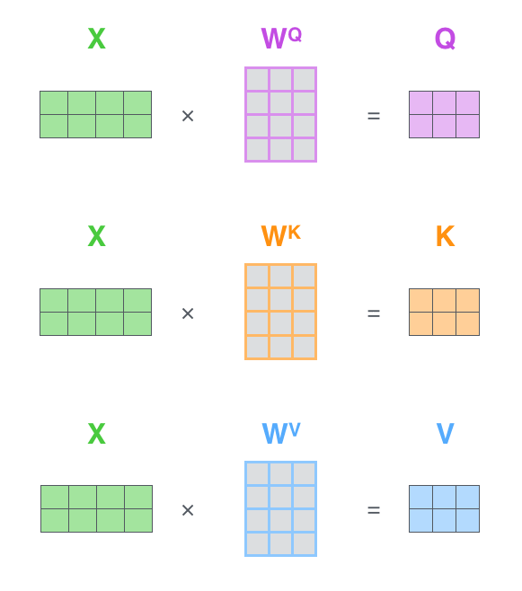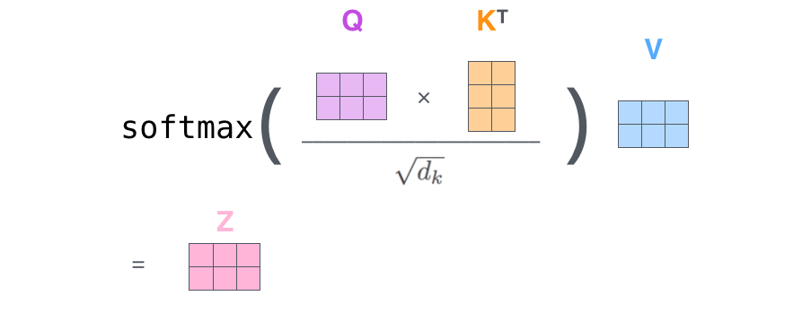

---
# Transformer – Multihead Attention

Multihead attention is used in practice. Instead of using one huge attention, we
split queries, keys and values to several groups (similar to how ResNeXt works),
compute the attention in each of the groups separately, and then concatenate the
results.

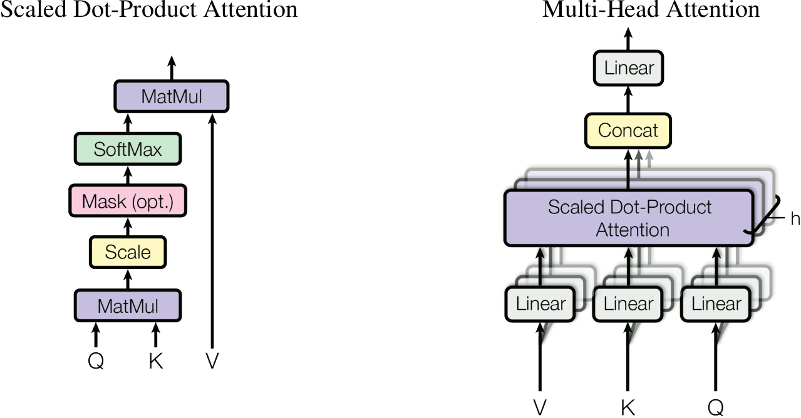

---
# Transformer – Multihead Attention

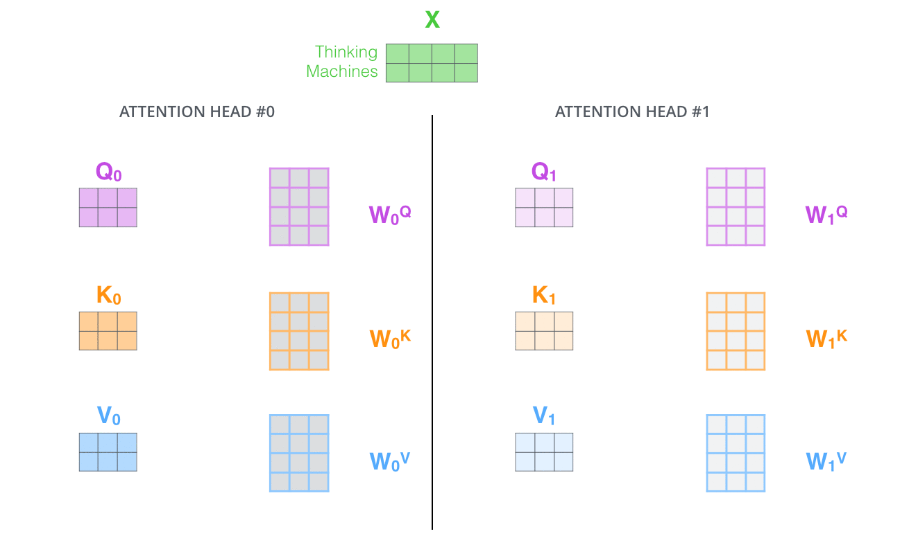

---
# Transformer – Multihead Attention

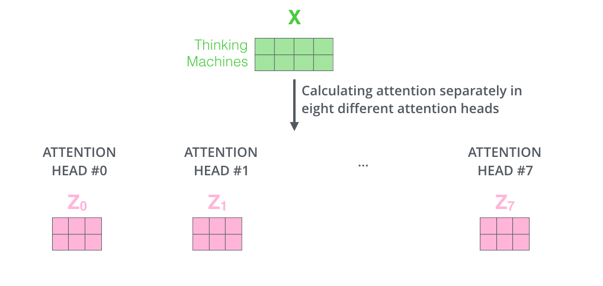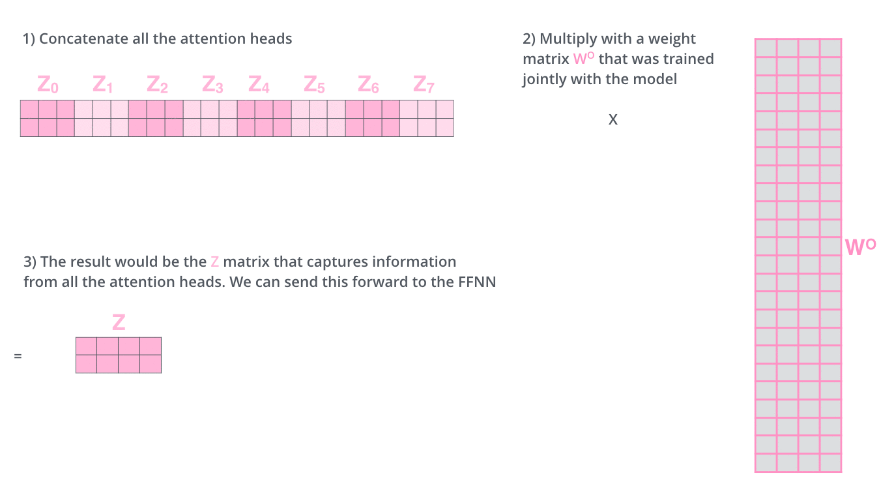

---
# Transformer – Multihead Attention

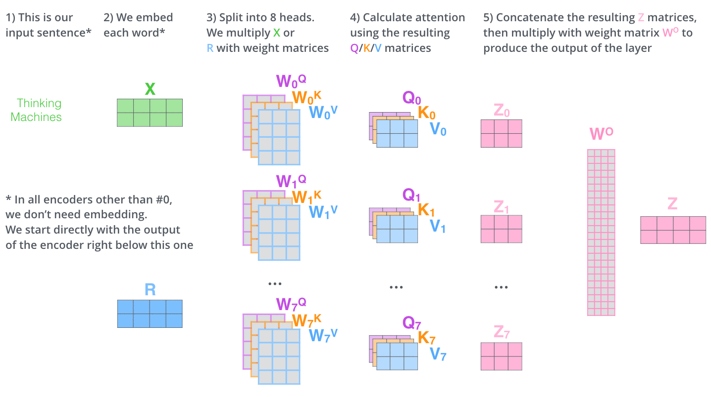

---
# Why Attention

---
# Transformer – Feed Forward Networks

## Feed Forward Networks

The self-attention is complemented with FFN layers, which is a fully connected
ReLU layer with four times as many hidden units as inputs, followed by another
fully connected layer without activation.

---
# Transformer – Residuals

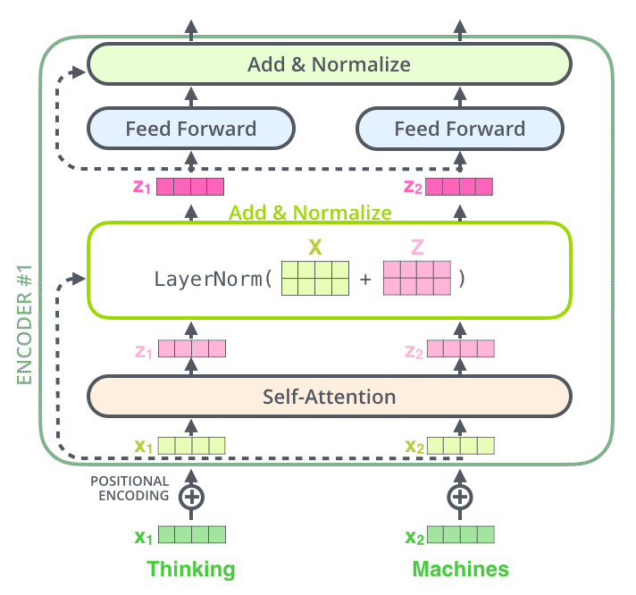

---
# Transformer – Decoder

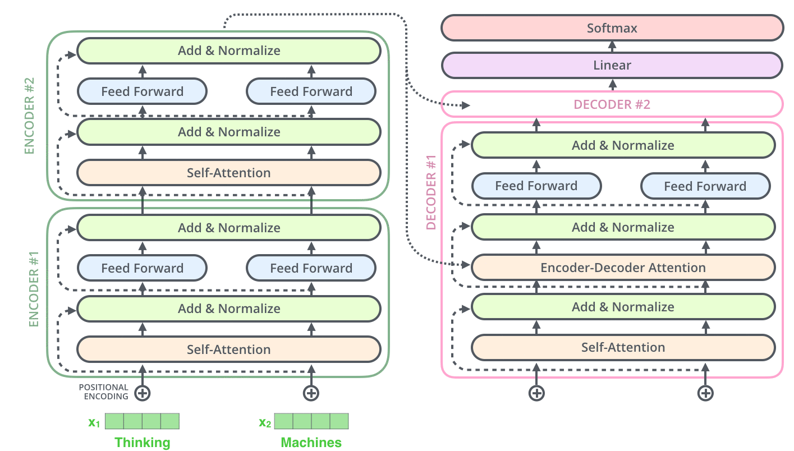

---
# Transformer – Decoder

## Masked Self-Attention

During decoding, the self-attention must attent only to earlier positions in the
output sequence.

~~~
This is achieved by _masking_ future positions, i.e., zeroing their weights out,
which is usually implemented by setting them to $-∞$ before the $\softmax$ calculation.

~~~

## Encoder-Decoder Attention

In the encoder-decoder attentions, the _queries_ comes from the decoder, while the
_keys_ and the _values_ originate from the encoder.

---
section: PositionalEmbedding
# Transformer – Positional Embedding

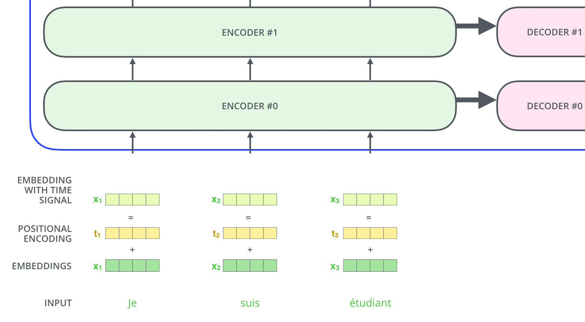

---
# Transformer – Positional Embeddings

## Positional Embeddings

We need to encode positional information (which was implicit in RNNs).

~~~
- Learned embeddings for every position.

~~~
- Sinusoids of different frequencies:
  $$\small\begin{aligned}
    \textrm{PE}_{(\textit{pos}, 2i)} & = \sin\left(\textit{pos} / 10000^{2i/d}\right) \\
    \textrm{PE}_{(\textit{pos}, 2i + 1)} & = \cos\left(\textit{pos} / 10000^{2i/d}\right)
  \end{aligned}$$

~~~
  This choice of functions should allow the model to attend to relative
  positions, since for any fixed $k$, $\textrm{PE}_{\textit{pos} + k}$ is
  a linear function of $\textrm{PE}_\textit{pos}$, because
  $$\small\begin{aligned}
    \textrm{PE}_{(\textit{pos}+k, 2i)}
      &= \sin\left((\textit{pos}+k) / 10000^{2i/d}\right) \\
      &= \sin\left(\textit{pos} / 10000^{2i/d}\right) ⋅ \cos\left(k / 10000^{2i/d}\right) + \cos\left(\textit{pos} / 10000^{2i/d}\right) ⋅ \sin\left(k / 10000^{2i/d}\right) \\
      &= \textit{offset}_{(k,2i)} ⋅ \textrm{PE}_{(\textit{pos}, 2i)} + \textit{offset}_{(k, 2i+1)} ⋅ \textrm{PE}_{(\textit{pos}, 2i + 1)}.
  \end{aligned}$$

---
# Transformer – Positional Embeddings

Positional embeddings for 20 words of dimension 512, lighter colors representing
values closer to 1 and darker colors representing values closer to -1.
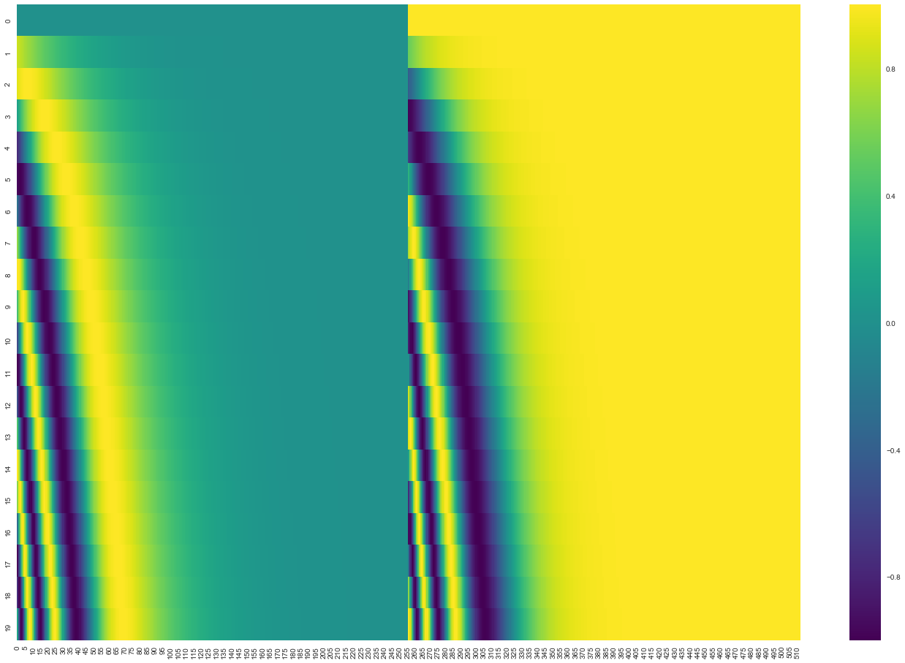

---
# Transformer – Training

## Regularization

The network is regularized by:
- dropout of input embeddings,
~~~
- dropout of each sub-layer, just before before it is added to the residual
  connection (and then normalized),
~~~
- label smoothing.

~~~
Default dropout rate and also label smoothing weight is 0.1.

~~~
## Parallel Execution
Because of the _masked attention_, training can be performed in parallel.

~~~
However, inference is still sequential.

---
# Transformer – Training

## Optimizer

Adam optimizer (with $β_2=0.98$, smaller than the default value of $0.999$)
is used during training, with the learning rate decreasing proportionally to
inverse square root of the step number.

~~~
## Warmup
Furthermore, during the first
$\textit{warmup\_steps}$ updates, the learning rate is increased linearly from
zero to its target value.

$$\textit{learning\_rate} = \frac{1}{\sqrt{d_\textrm{model}}} \min\left(\frac{1}{\sqrt{\textit{step\_num}}}, \frac{\textit{step\_num}}{\textit{warmup\_steps}} ⋅ \frac{1}{\sqrt{\textit{warmup\_steps}}}\right).$$

~~~
In the original paper, 4000 warmup steps were proposed.

---
# Transformers Results

---
# Transformers Results

---
# Transformers Results

## Main Takeaway

Generally, Transformer provides more powerful sequence-to-sequence architecture
and also sequence element representation architecture than RNNs, but usually
requires substantially more data.
